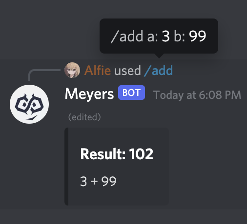

# Reaccord

A simple, and clean framework to build reactive discord apps using [React](https://reactjs.org/) + JSX and [Discord.js](https://discord.js.org/).

> Disclaimer: Reaccord is using the development version of `discord.js` (v14), so the API is still unstable and may not be suitable for production yet.

## Usage

```tsx
import { Client } from "reaccord"

// Create client
const client = new Client({
    token: "token",
    intents: ["Guilds", "GuildMessages", "GuildMessageReactions"],
    devGuildId: "dev-guild-id",
    clientId: "client-id",
})

// Register simple `ping` command
client.createSlashCommand("ping", "Ping").render(() => <content>Pong</content>)

// Connect client
client.connect((client) =>
    console.log(`🚀 Client connected as ${client.user?.username}!`),
)
```

**Result**  


## A few more examples

### `Echo` command with a required string parameter

```tsx
client
    .createSlashCommand("echo", "Echoes msg")
    .addString("input", "Message to be echoed", { required: true })
    .render(({ input }) => <content>{input}</content>)
```

**Result**  


### `Add` command with two optional number parameters

```tsx
client
    .createSlashCommand("add", "Add two numbers")
    .addNumber("a", "First number")
    .addNumber("b", "Second number")
    .render(({ a = 0, b = 0 }) => (
        <embed>
            <title>Result: {a + b}</title>
            <desc>
                {a} + {b}
            </desc>
        </embed>
    ))
```

**Result**  

