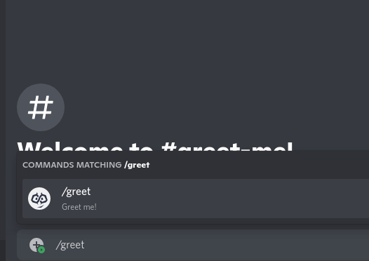

<div align="center">
    
    <h1 style="font-weight: bold">
        <a href="https://djobbo.github.io/reaccord" target="_blank" rel="noreferrer">Reaccord</a>
        <div>
        <a aria-label="reaccord NPM button" href="https://www.npmjs.com/package/reaccord" target="_blank" rel="noreferrer">
            
        </a>
        <a aria-label="reaccord router NPM button" href="https://www.npmjs.com/package/@reaccord/router" target="_blank" rel="noreferrer">
            
        </a>
				<a aria-label="reaccord canvas NPM button" href="https://www.npmjs.com/package/@reaccord/canvas" target="_blank" rel="noreferrer">
            
        </a>
        </div>
    </h1>

A simple, and clean framework to build discord apps declaratively using [React](https://reactjs.org/) + JSX and [Discord.js](https://discord.js.org/).

<a href="https://djobbo.github.io/reaccord" target="_blank" rel="noreferrer">Explore the docs...</a>

</div>

## Here is simple greeter bot

This is a simple bot that greets users when they use the `/greet` command.



You can define the bot's behavior declaratively using [React](https://reactjs.org/) + JSX.  
And even generate images using a reactDOM renderer, with client side libraries like [tailwindcss](https://tailwindcss.com/).

[View complete typescript example here](https://github.com/djobbo/reaccord/tree/master/examples/greeter)

```tsx
const greetingCommand = new ChatInputCommand("greet", "Greet me!").render(
  (_, interaction) => (
    <>
      <Content>{interaction.user.toString()}, welcome!</Content>
      <Embed>
        <Title>I am a bot designed to greet you!</Title>
        <Color color="Orange" />
        {/* Generate images with a react-dom-canvas component. */}
        <CanvasImage id="greeting" width={320} height={80}>
          <script src="https://cdn.tailwindcss.com"></script>
          <div className="bg-gray-800 w-screen h-screen flex justify-center items-center">
            <h1 className="text-lg font-bold text-white">
              Hello {interaction.user.username}!
            </h1>
          </div>
        </CanvasImage>
      </Embed>
      <ActionRow>
        <Button
          onClick={() => {
            interaction.channel?.send("Hello!")
          }}
        >
          Say Hello!
        </Button>
      </ActionRow>
    </>
  ),
)
```
